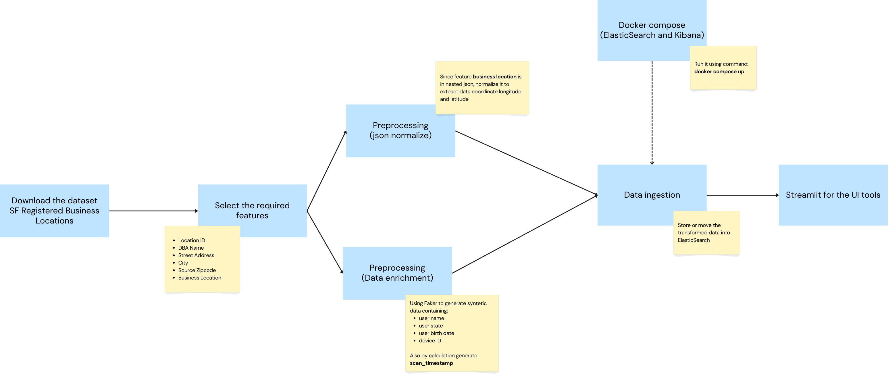
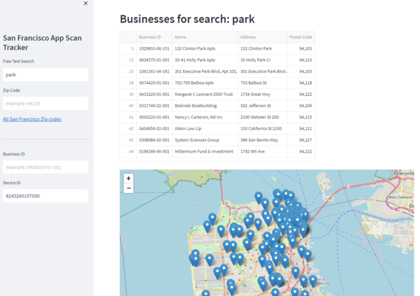
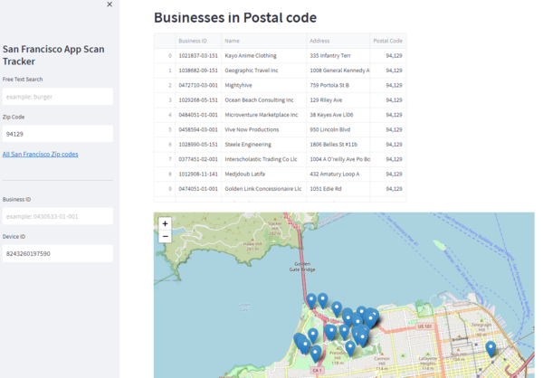
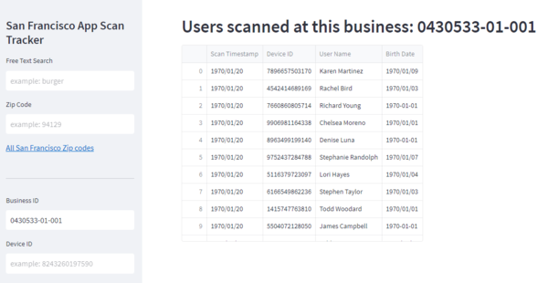
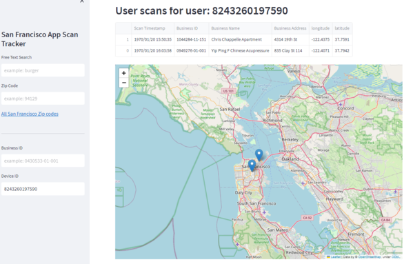

# Contact Tracing Streamlit App
An app, generated from Streamlit library, can be used for tracing the historical contact location, it is usually done especially during the COVID-19 pandemic. Through the app the tracing process can be searched based on `free text`, `zip code`, `business ID`, and `device ID`.
## Table of Contents
- [Dataset](#dataset)
- [Project Flow](#project-flow)
- [Streamlit App](#streamlit-app)

## Dataset
The location dataset to represent contact tracing refer to [SF Registered Business Locations - San Francisco](https://www.kaggle.com/datasets/san-francisco/sf-registered-business-locations-san-francisco).
The dataset consists of 250,245 records. While the columns as following:
1. Location Id
2. Business Account Number
3. Ownership Name
4. DBA Name
5. Street Address
6. City
7. State
8. Source Zipcode
9. Business Start Date
10. Business End Date
11. Location Start Date
12. Location End Date
13. Mail Address
14. Mail City
15. Mail Zipcode
16. Mail State
17. NAICS Code
18. NAICS Code Description
19. Parking Tax
20. Transient Occupancy Tax
21. LIC Code
22. LIC Code Description
23. Supervisor District
24. Neighborhoods - Analysis Boundaries
25. Business Corridor
26. Business Location

But the important columns that needed in the project are:
1. **Location ID**: Location Identification Number. Each DBA has a unique LIN for location specific tax filings
2. **DBA Name**: Doing Business As Name or Location Name (Business name)
3. **Street Address**: Business location street address
4. **City**: Business location city
5. **Source Zipcode**: Business location zip code
6. **Business Location**: The latitude and longitude of the business location for mapping purposes

## Requirements
- The project use python 3.8 (but it might be ok to  use later version).
- Whereas the python library needed, please kindly check the [requirements.txt](./requirements.txt)
- Other than that, it is mandatory to install docker.
## Project Flow

- Download the dataset
- The project only need six columns from the dataset, those are: `location ID`, `DBA name`, `street address`, `city`, `source zipcode`, and `business location`.
- Then normalize the json data within `business location` into `langitude` and `longitude` data.
- Add some columns by creating fake data using Faker library. Those additional columns are: `user_name`, `user_state`, `user_birth_date`, and `deviceID`.
- While columns `scan_timestamp` to simplify the case in the project, it created from random date between two date values.
- Those mention-above conclude the final columns used:
    1. `Location ID` (renamed to `business_id`)
    2. `DBA Name` (renamed to `business_name`)
    3. `Street Address` (renamed to `business_address`)
    4. `city`
    5. `Source Zipcode` (renamed to `zip`)
    6. `langitude`
    7. `longitude`
    8. `user_name`
    9. `user_state`
    10. `user_birth_date`
    11. `deviceID`
    12. `scan_timestamp`
- After that, create run a docker compose file to build image for service Elasticsearch and Kibana.
- Dump the transformed dataset into Elasticsearch
- Build streamlit app to visualize the UI.
## Streamlit App
 Here are some functionality in the contact tracing streamlit app:
### 1. Search by Free Text

### 2. Search by Zip Code

### 3. Search by Business ID

### 4. Search by Device ID

